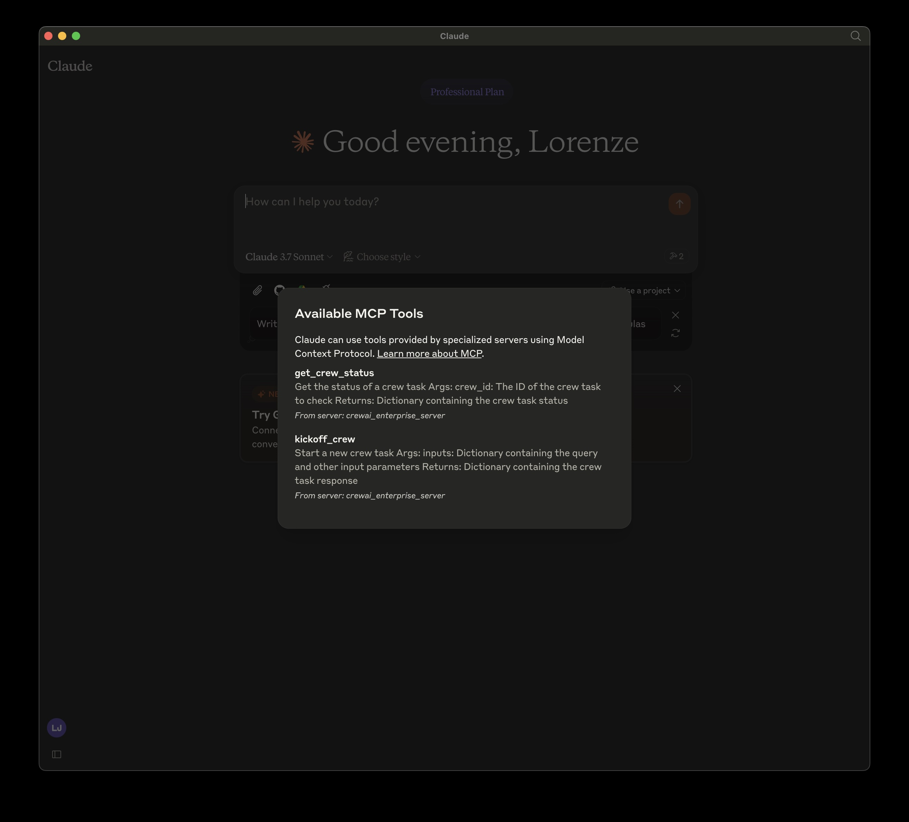
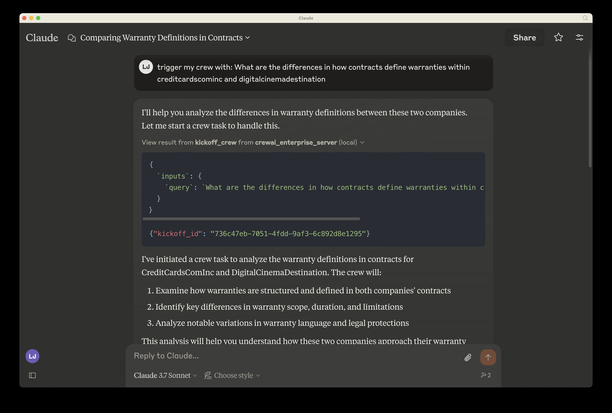
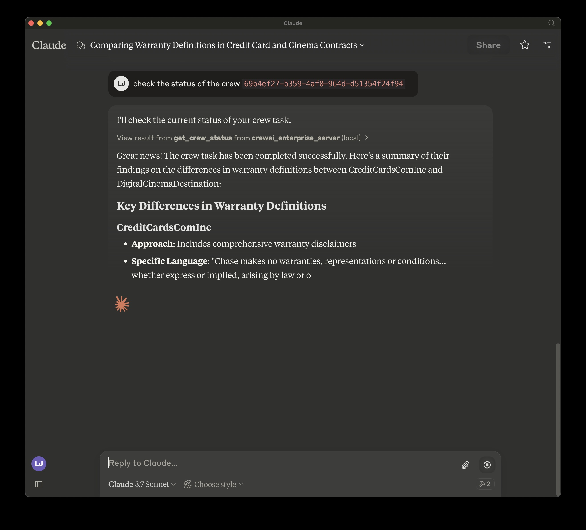

# CrewAI Enterprise MCP Server

## Overview

A Model Context Protocol (MCP) server implementation that provides deployed CrewAI workflows. This server enables kicking off your deployed crew and inspect the status giving the results of your crew.

<a href="https://glama.ai/mcp/servers/@crewAIInc/enterprise-mcp-server">
  
</a>

## Tools

- kickoff_crew
- get_crew_status

## Env Variables

retrieve from app.crewai.com
`MCP_CREWAI_ENTERPRISE_SERVER_URL`
`MCP_CREWAI_ENTERPRISE_BEARER_TOKEN`

# Usage with Claude Desktop





To use this MCP server with Claude Desktop, follow these steps:

1. Open Claude Desktop
2. Go to Settings > Developer Settings
3. Add a new MCP server with the configuration shown below

## Locally, cloned repo:

Install `mcp` and `mcp[cli]` locally

```json
{
  "mcpServers": {
    "crewai_enterprise_server": {
      "command": "uv",
      "args": [
        "run",
        "--with",
        "mcp[cli]",
        "mcp",
        "run",
        "<filepath of cloned repo>",
        "/crewai_enterprise_server.py"
      ],
      "env": {
        "MCP_CREWAI_ENTERPRISE_SERVER_URL": "<>",
        "MCP_CREWAI_ENTERPRISE_BEARER_TOKEN": "<>"
      }
    }
  }
}
```

## TODO: Added on PyPI: